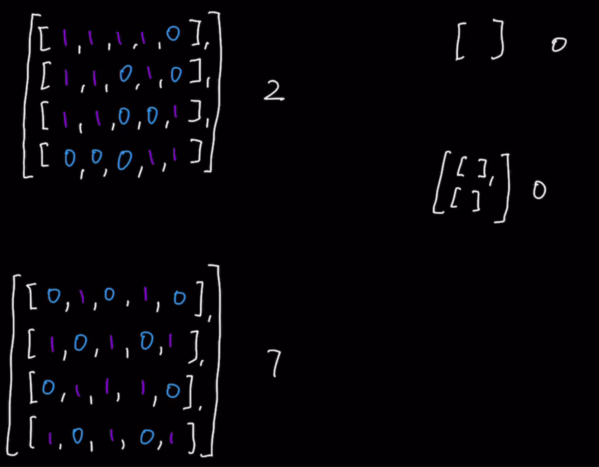

### Question

* https://leetcode.com/problems/number-of-islands/
* Given an m x n 2D binary grid grid which represents a map of '1's (land) and '0's (water), return the number of islands.
* An island is surrounded by water and is formed by connecting adjacent lands horizontally or vertically. You may assume all four edges of the grid are all surrounded by water.

### Step 1: Verify the constrainsts

* Can all the values be 0
* Island cannot be connected diagonally

### Step 2: Write down some test cases

* [1] : 1
* [[1,1,0,1,1],[0,0,1,1,1]] : 2
* [[1,1,0,0,0],[1,1,0,0,0],[0,0,1,0,0],[0,0,0,1,1]]: 3

 
### Step 3: Solution without code

* **Author's approach**
* Both array approach and traversal with BT approach
* Traversing: Sequential, BFS or DFS
  * We will do Sequential in this
* Using sequential is advantageous when
  * We have to traverse all elements without any particular order
  * Unlike bfs or dfs, it has Space Complexity of O(1)
* If value is 0, it doesn't impact count
* If value is 1, then count increases if it is a new island else it will remain the same since it is part of old island
* 2 subproblems
  * Tracking count of unique islands
  * While traversing, we need to check if it's an old or new island
* To traverse, we will use sequential and then for subproblems we will use bfs or dfs
* Here bfs or dfs is used because we are traversing adjacent element's up, down, left and right. If even diagonal was included, then we had to take different approach
* When new land is discovered, increment count and bfs or dfs and turn all 1s to 0s
  * This approach of turning bfs or dfs traversed elements to 0 is **awesome** because we don't need additional data structure(array of arrays or dictionary) to keep track
  * Behavior of old island(1) is similar to 0

### Step 4: Solution with code

* 