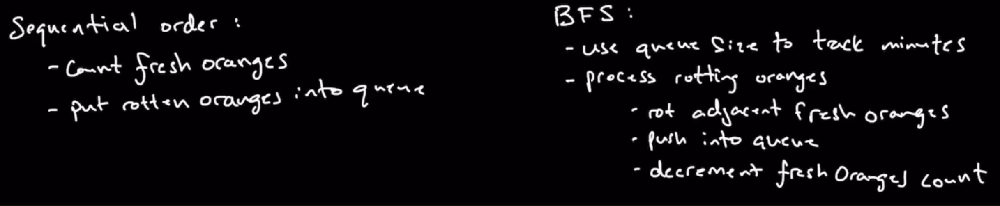

### Question

* https://leetcode.com/problems/rotting-oranges/
* You are given an m x n grid where each cell can have one of three values:
```txt
0 representing an empty cell,
1 representing a fresh orange, or
2 representing a rotten orange.
Every minute, any fresh orange that is 4-directionally adjacent to a rotten orange becomes rotten.

Return the minimum number of minutes that must elapse until no cell has a fresh orange. If this is impossible, return -1.
```

### Step 1: Verify the Constraints

* Empty grid: Return 0
* All Fresh with or without empty cells: Return -1
* All Rotten with or without empty cells: Return 0

### Step 2: Write some test cases

* [] : -1
* [0] : -1
* [[1,0],[0,1]] : -1
* [[2,2],[0,2]] : 0
* [[1,1,1,1,2,0], [0,2,2,0,1,1], [0,1,0,1,0,2]]: -1
* [[1,1,1,1,2,0], [0,2,2,1,1,1], [0,1,0,1,0,2]]: -1

### Step 3: Solution without code

* Create one more array called cost_matrix which has all values of 0
* Traverse matrix sequentially and when you encounter 2
  * BFS or DFS to all elements which have 1 and cost of that neighbor is either 0 or cost[cur] + 1 < cost[neighbor]
  * Update cost matrix for that neighbor and make it current and follow the above step
* After everything is done, take cost_matrix and
  * If for values of 1 in matrix, the cost is not 0
    * Then take maximum in cost_matrix and return it
  * Else
    * Return -1
* **Author's Approach**
* Keep track of minutes for all fresh to rot
  * The rotting occurs in a ring fashion level by level(suggesting BFS)
* Need to figure out where and how many all of the original rotting oranges are 
* Also need to figure out where Fresh oranges cannot be reached
  * This is a separate problem from the others
  * So, either we can keep track of fresh oranges in the beginning or after all the rotting is done
* **Subproblems**

  * Sequential order
    * Rotting oranges: Add these to queue
    * Track of Fresh oranges
  * Rotting Fresh, decreasing Fresh count and keeping track of minutes
    * Use BFS to rot fresh and decrease Fresh count and add to Queue
    * Use similar logic in level order traversal to keep track of minutes
      * Have length of queue in a variable and increment minute when queue_length equals zero and recalculate queue_length
      * *Note*: We shouldn't increment count when there are no more fresh oranges in the vicinity(or the very last level)
    * If Fresh oranges count is greater than 0 when queue is empty return -1 else return minutes

### Step 4: Solution with code

* Use BFS technique for better space complexity
* **Author's approach**
* He used constants for Rotten, Fresh and Empty

### Step 5: Double check for Errors

### Step 6: Walk through the Test Case

### Step 7: Time and Space Complexity

* Time Complexity in my case: O(n) Not sure
  * Sequential traversing: O(m*n) or O(n), n is total size of the 2d array
  * BFS is O(n) and since this is nested within sequential touches every element, but checking next question we see this is a minor factor and is dropped
* Space Complexity in my case: O(n)
  * cost_matrix is O(n)
  * queue is O(min(m,n))
* Author's Time Complexity: O(n)
  * Double for loop for fresh_count and pushing to queue(Touch every element once): O(n)
  * BFS: Even while loop touches every element once in worst case(Every element is a rotting orange): O(n)
* Author's Space Complexity: O(n)
  * Storing rotten oranges to queue