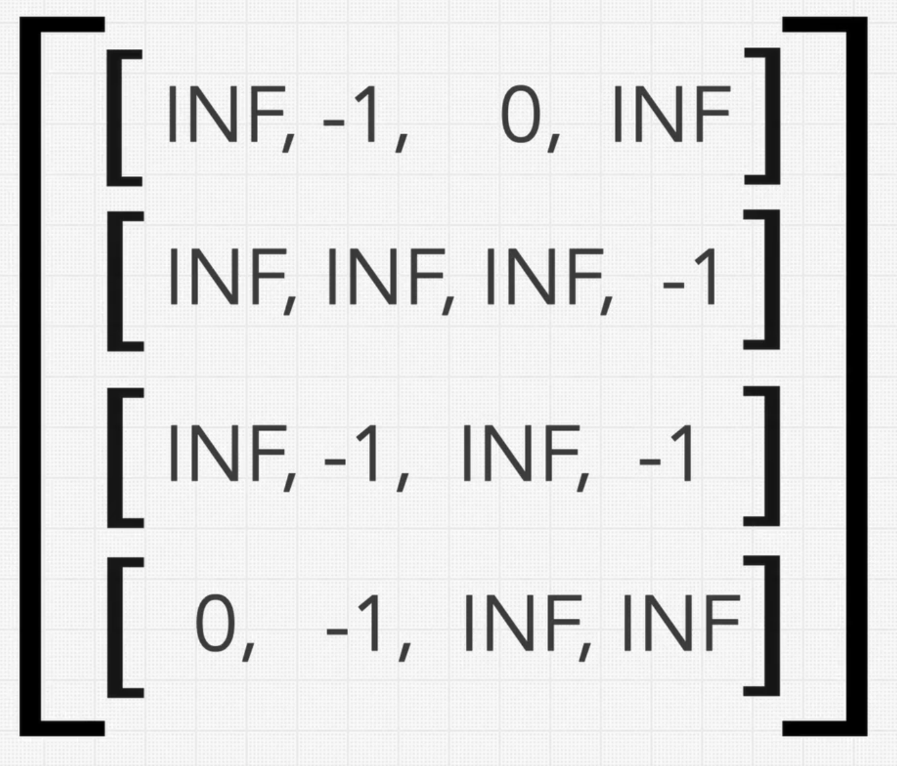
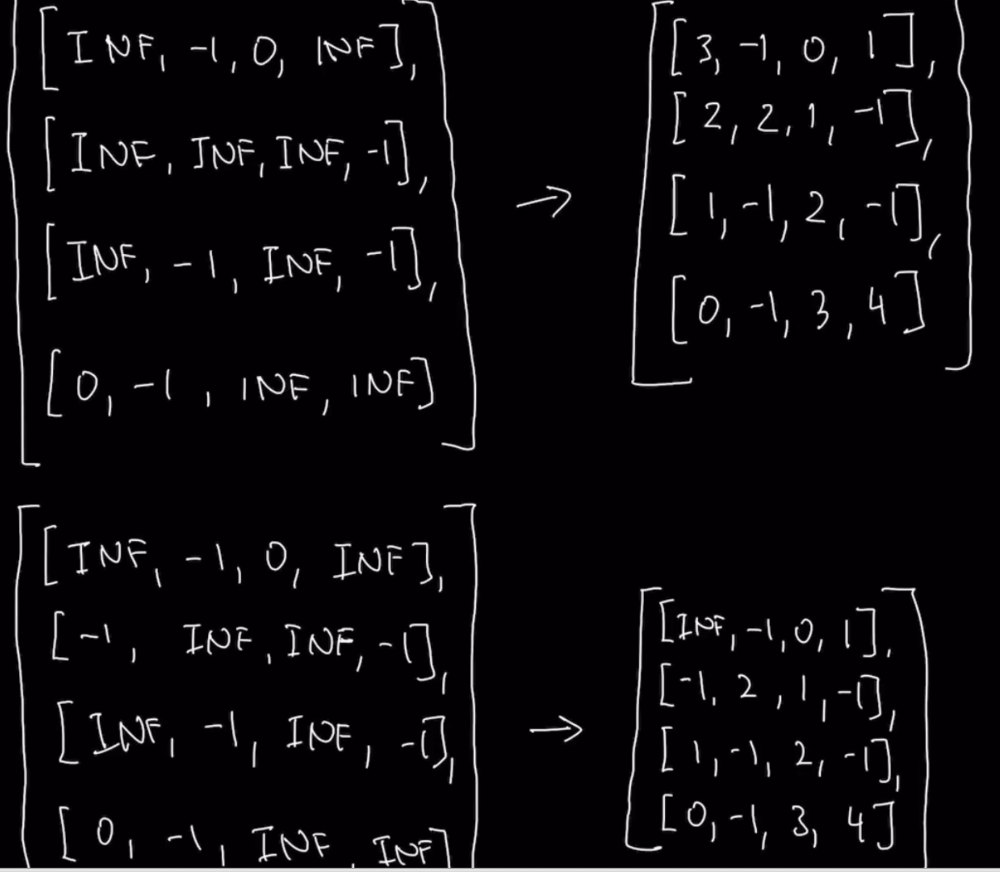

### Question

* Walls and Gates
* Given a 2D Array containing -1's(walls), 0's(gates) and INF's(empty room)
* Fill each empty room with the number of steps to the nearest gate
* If it is impossible to reach a gate, leave INF as the value. INF is equal to 2147483647

### Step 1: Verify the Constraints

* How can the steps be taken(Up, down, left, right and also diagonally)?
* Empty array, what to return?
  * Return back whatever we receive
* What if there are no Rooms?
* What if there are no Gates? 
  * Return back whatever we receive

### Step 2: Write out some test cases

* Check the Question's test cases

### Step 3: Solution without code

* Find all empty rooms(INF) adjacent gates(0) during initial sequential search and convert them to 1s and add them to queue
* Next do a BFS for empty rooms(INF) and add cur value + 1 and place them to queue again
* **Author's approach**
* Subproblems
  * No of steps to every single gate from empty room
  * Nearest gate
* But this is a lot of repetitive work
* This is because of the relationship between an empty cell and a gate
* Start position and End position
  * If you treat every INF as a start position and every gate as an end position, all the starting positions are different, but the ending positions are the same
  * Most of the INF share the same Gate as the end position
  * The direction you come from doesn't matter(i.e you can start from end position as well as start position), since the number of steps remains the same
* So if we traverse from Gate to every single INF, we will get the number of steps we need from that Gate
* Then while traversing from other Gate, if the number of steps is lesser, then we know this gate is closer to the Empty cell
* For traversing from Gates, we can choose either DFS or BFS

### Step 4: Solution with code

### Step 5: Double Check for Errors

### Step 6: Walk through the Test cases

### Step 7: Time and Space Complexity

* Time Complexity: O(n)
* Space Complexity: O(n)