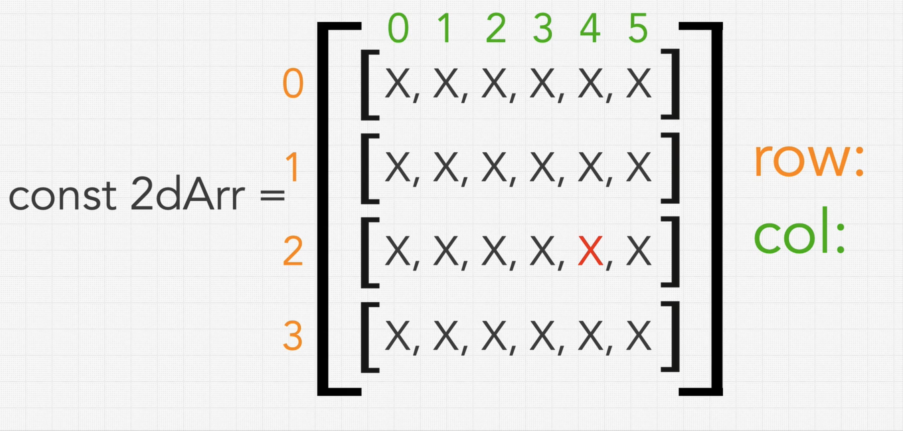

### 2D-Arrays

* Array containing arrays
* Row, col

### DFS and BFS in 2D-Arrays

* With Binary Tree, we start from root, whereas with 2D-Arrays we can start from anywhere, but usually we start from 0,0
* With Binary Tree, any 2 directions left or right
* With 2D-arrays, 4 directions: up, down, left or right
* With DFS, traverse in the same direction
* With 2D-Arrays, **DFS** is explore as far as in one of the 4 directions until you hit a wall or going back to element we have already explored
* With 2D-Arrays, my dfs implementation is read, Up, Right, Down and Left

### Author's DFS Implementation

* DS used
  * directions Array of Arrays
  * seen Array of Arrays
* Time Complexity: O(n)
  * We are going to touch every element once
* Space Complexity: O(n)
  * seen data structure
  * As well as recursive stack may be holding all of the elements