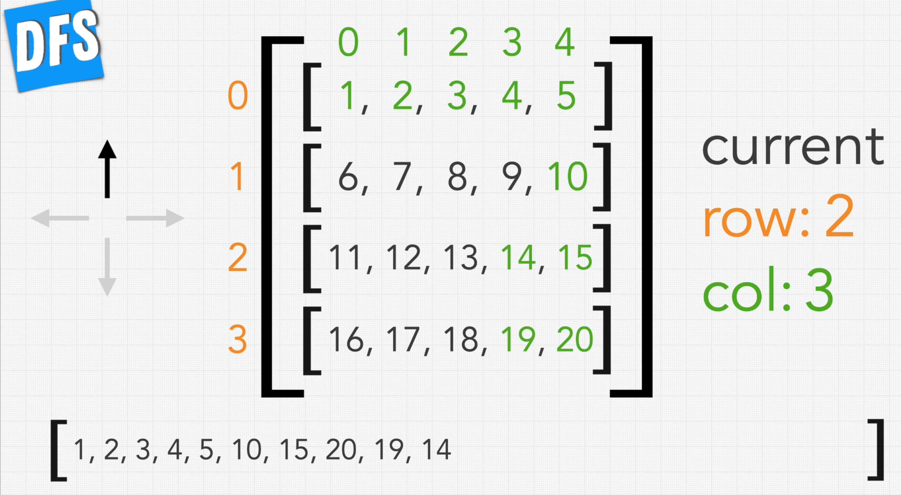
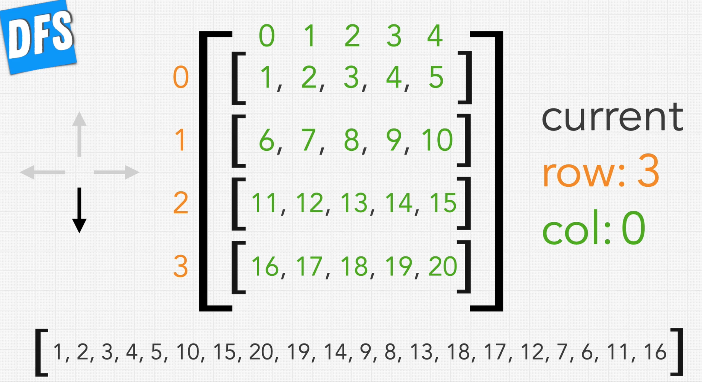
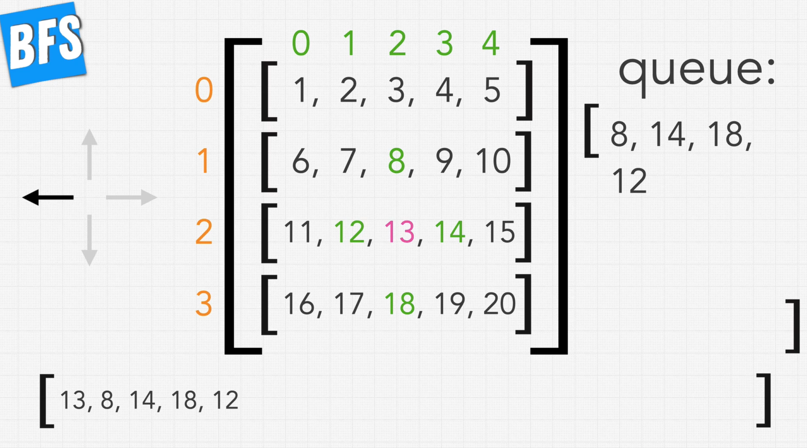
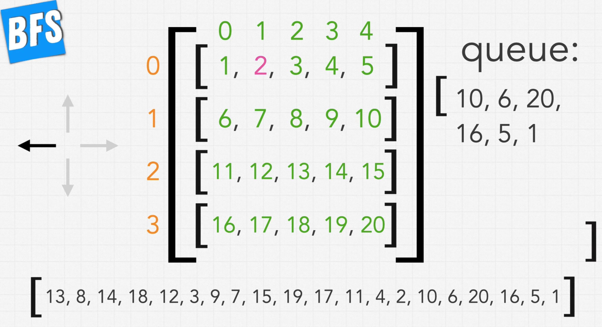
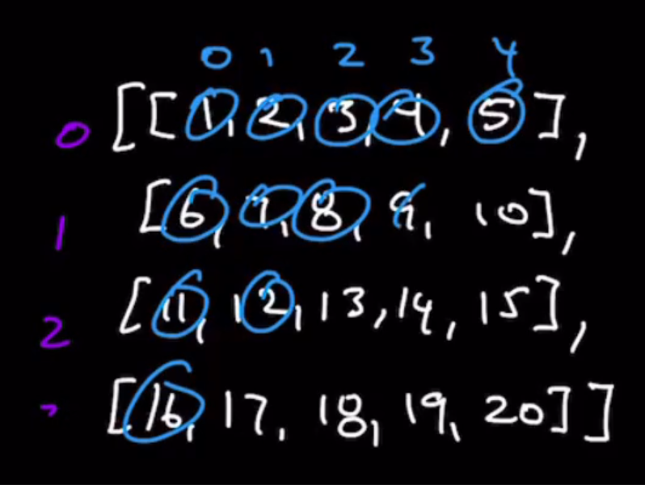

### 2D-Arrays


* Array containing arrays
* Row, col
* Check **Approach for 2d arrays in approach.md**
* Python filling 2d arrays
```py
[[0] * col for _ in range(row)]
```
* JS filling 2d arrays
```js
const seen = new Array(matrix.length)
    .fill(0)
    .map(() => new Array(matrix[0].length).fill(false));
```

### DFS and BFS in 2D-Arrays

* With Binary Tree, we start from root, whereas with 2D-Arrays we can start from anywhere, but usually we start from 0,0
* With Binary Tree, any 2 directions left or right
* With 2D-arrays, 4 directions: up, down, left or right
* With DFS, traverse in the same direction
* With 2D-Arrays, **DFS** is explore as far as in one of the 4 directions until you hit a wall or going back to element we have already explored


* With 2D-Arrays, my dfs implementation is read, Up, Right, Down and Left
* With 2D-Arrays, **BFS** is *expanding in a ring* from our starting element taking the immediate vicinity elements(Up, Right, Down and Left) and putting them in a queue



### Author's DFS Implementation

* DS used
  * directions Array of Arrays
  * seen Array of Arrays
* Time Complexity: O(N)
  * We are going to touch every element once
* Space Complexity: O(N)
  * seen data structure
  * As well as recursive stack may be holding all of the elements

### Author's BFS Implementation

* He checks for bounds at the start itself, whereas I do it at the end
* Time Complexity: O(N)
  *  We are going to touch every element once
* Space Complexity: O(N)
  * seen data structure, this is the worst case
  * values: Only bfs through them and not store them in actual
  * queue also values only till Next level(Shown in diagram below)
