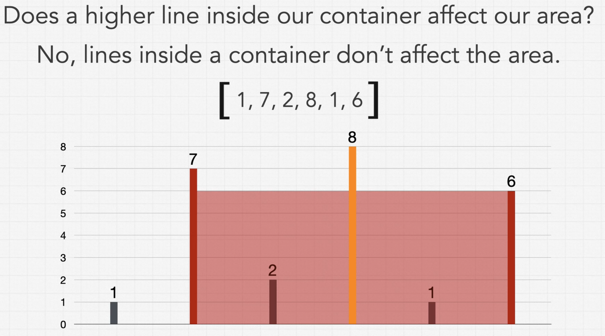

### Question

* Given n non-negative integers a1, a2, ..., an , where each represents a point at coordinate (i, ai). n vertical lines are drawn such that the two endpoints of the line i is at (i, ai) and (i, 0). Find two lines, which, together with the x-axis forms a container, such that the container contains the most water
* https://leetcode.com/problems/container-with-most-water/

### Step 1: Verify the constraints

* Does the thickness of the lines affect the area?
  * No, assume they take up no space
* Do the left and right sides of the graph count as walls?
  * No, the sides cannot be used to form a container
* Does a higher line inside our container affect our area?
  * No, lines inside a container don't affect the area

### Step 2: Write out some test cases

* What is the best test case
  * [7, 1, 2, 3, 9] = 28
    * We know for certain 7 and 9
    * Greatest and farthest apart
* Empty array and 1 Array
  * [] = 0
  * [7] = 0
* Not obvious what the correct answer is
  * [6, 9, 3, 4, 5, 8]
    * 6 and 8 or 9 and 8
    * 6 * 5 = 30, 8 * 4 = 32
    