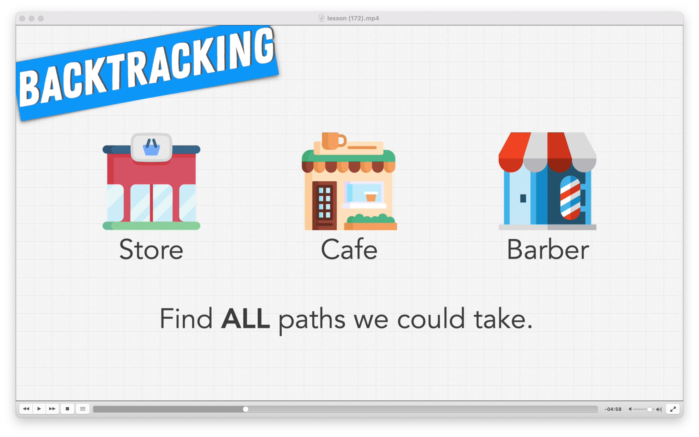
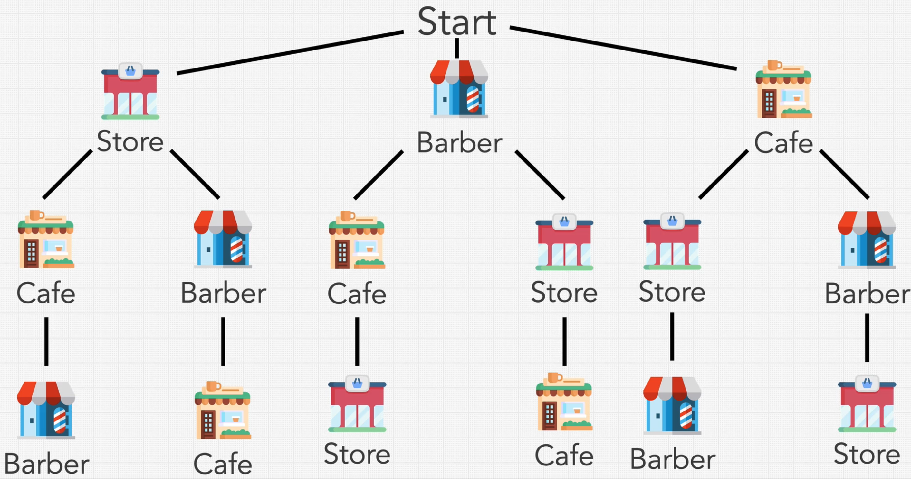
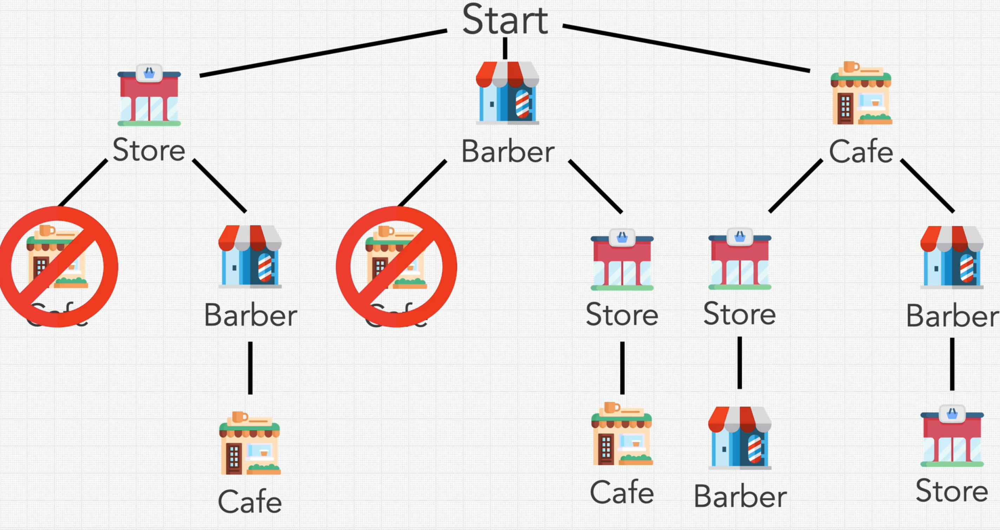

### BackTracking

* Similar to DP,but 
  * we return ALL of the solutions or
  * we return a VALID solution amongst all solutions
    * i.e there are certain constrainsts in play that prevent all of the solutions from being correct
    * This is different from an Optimization question(one solution amongst all of the solutions)
* Very logical, almost Brute Force solution
* If the path being explored has violated the Constraint, then you are not going down that path anymore

### Example

* Constraint of Cafe cannot be the second place to visit

### How do we recognize that this question **requires Backtracking?**
* If we need to solve all the solutions or valid solutions or one valid solution
* Backtracking is a possible option for the above
* In order to solve the problem, need to generate all of the solutions that could exist
  * But not all of them are valid
  * If at any point it is invalid, don't bother generating for that particular path

### Rough outline of every Backtracking solution

* args - Current element
* ans - Final Answer we are building towards
* 3 main things
  * Addition
  * Decision
  * Removal