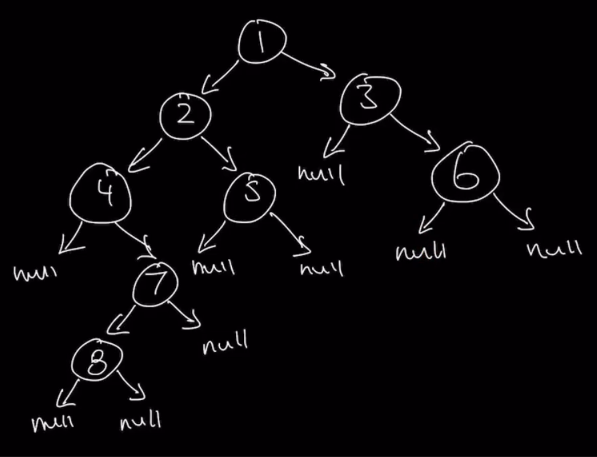

### Question 

* https://leetcode.com/problems/binary-tree-right-side-view/
* Given the root of a binary tree, imagine yourself standing on the right side of it, return the values of the nodes you can see ordered from top to bottom.

### Step 1: Verify the Constrainsts

* What to return when root is null
  * Empty array

### Step 2: Test cases

* Right completely obstructing the left
* Right partially obstructing the left
* No obstruction

* Things to account for when coming up with Test Case
  * There are nodes which we cannot see when we are on the Right side of the Tree
  * Nodes also on the left branch of the Tree that are not obstructed
  * Null case, return empty array
  * Single value, return array with single value

### Step 3: Solution without code

* BFS Answer
  * Last element at every level
* DFS Answer
  * Start with Preorder of rRL
  * Use global counter and level passed to each node to push the result

### Step 4: Solution with code

### Step 5: Double check for errors

### Step 6: Walk through the test cases

### Step 7: Time and Space Complexity