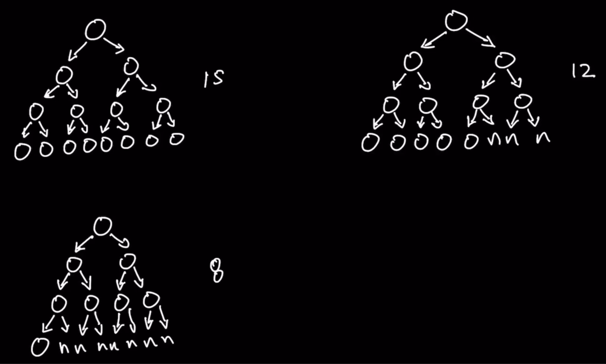

### Question

* https://leetcode.com/problems/count-complete-tree-nodes/
* Given the root of a complete binary tree, return the number of the nodes in the tree.
* According to Wikipedia, every level, except possibly the last, is completely filled in a complete binary tree, and all nodes in the last level are as far left as possible. It can have between 1 and 2h nodes inclusive at the last level h.
* Design an algorithm that runs in less than O(n) time complexity
* **Difference between Full BT and Complete BT**
  * Full Binary Tree: Every node has either 0 or 2 children
  * Complete Binary Tree: Every level, except possibly the last, is completely filled in a complete binary tree, and all nodes in the last level are as far left as possible

### Step 1: Verify the Constraints

* Empty? return 0

### Step 2: Test Cases

### Step 3: Solution without code

* Both BFS and DFS, as they both touch every nodes
* But there are insights to be derived from Complete Binary Tree
* Less than O(n) gives O(logn) and O(1)
* In a Complete Full BT,
  * Time Complexity of Height of tree in Complete Binary Tree is log2(n) where n is the number of nodes
  * Number of elements in the last level is n/2
* 2 parts
  * Number of nodes except in the last level(2^(h-1) - 1)
    * Time Complexity to find Height of tree in Complete Binary tree is O(logn)
    * To apply formula O(1)
  * Number of nodes in the Last level
    * Hints: Binary Search and Searching the Rightmost node at the last level
    * First go for Rightmost tree
    * If not found, then Binary search for Rightmost tree for left Tree
    * From then on, find midway between rightmost and left rightmost
    * Not Found, left child, else right child
      * 2 methods, 1 to find the rightmost element from a given node
      * Another to determine whether to go with left tree or right tree
* **Author's approach**
  * Binary Search
    * Think only of the last level elements and give them index starting from 0
    * The range is 0 and 2^level - 1(Assuming level starts from 0)
    * When left is equal to right, we have found the desired index
  * Traversing down from root to see if it exists
    * Traverse left or right based on mid value obtained from left and right range
    * If left is equal to right, then we have arrived at the desired indexToFind
      * Then we have to check whether that node exists or not

### Step 4: Solution with code

* 3 main methods: findLastLevel, binarySearch and checkNodeExists
* Using ceil and including left value

### Step 5: Double check for errors

### Step 6: Walk through the test case

### Step 7: Time and Space Complexity

* Time Complexity: O(logn)
  * findLastLevel Time Complexity is height of Complete Binary tree which is O(logn)
  * binarySearch is O(logn)
  * checkNodeExists is also O(logn)
* Space Complexity: O()