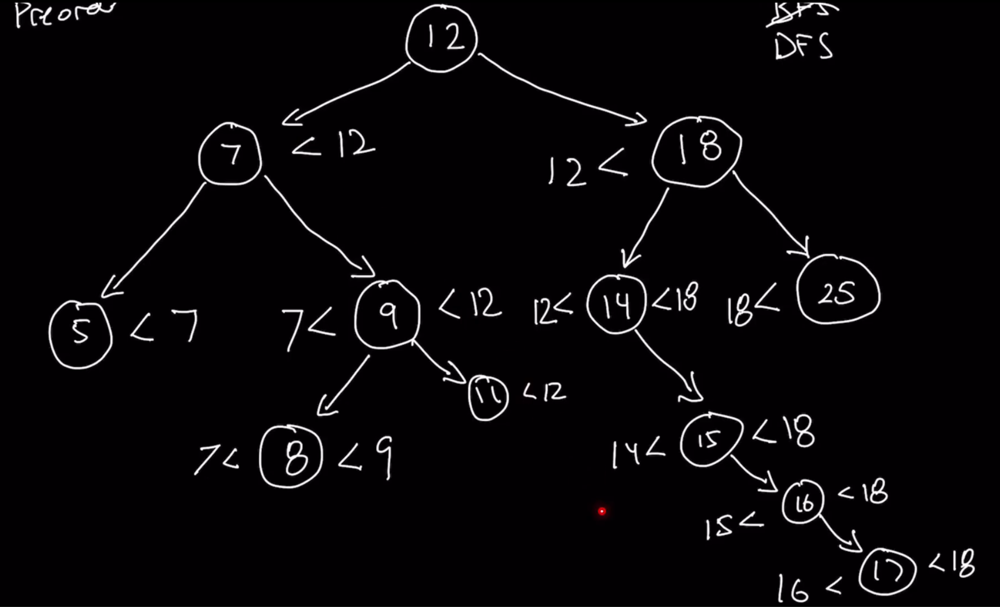

### Question

* https://leetcode.com/problems/validate-binary-search-tree/
* Given the root of a binary tree, determine if it is a valid binary search tree (BST).

A valid BST is defined as follows:

The left subtree of a node contains only nodes with keys less than the node's key.
The right subtree of a node contains only nodes with keys greater than the node's key.
Both the left and right subtrees must also be binary search trees

### Step 1: Verify the Constrainsts

* Will there be duplicates
  * Yes, but it is not a valid BST
* Can there be negative numbers
* What about values equal to a node, should it go left or right
* What should be the return value

### Step 2: Sample test cases

* [10, 5,15,4,6,12,16,null,null,null,null,11,13,null,null,null,null,null,14]
  * True
* [10, 5,15,4,16,12,16,null,null,null,null,11,13,null,null,null,null,null,14]
  * False
* null
  * True
* 10
  * True

### Step 3: Solution without code

* Navigate: BFS or DFS?
  * Not BFS, because there is no established relation at the same level
* If DFS, which one?
* Inorder Traversal
* **Author's approach**
* With Inorder and Postorder, we don't know what the previous values are
* He uses Preorder Traversal
  * Because we process the value first and traverse later
* When traversing left, the less than value changes to parent's value
* When traversing right, the greater than value changes to parent'se value

### Step 4: Solution with code

* Used lastSeenValue and valid as Global variables in JS and Instance variables in Python
* Compared lastSeenValue with current root value and if it is lesser than or equal, return invalid
* **My author's imp**
* Used global valid and checking for left and right boundary comparison
* **Author's imp**
* Use of -Infinity and Infinity is better because in my imp, I have to check whether lt and rt is not null in each call
* We can't return dfs(...) because we haven't even done dfs(node.right...) for this particular node, so *if condition* is added to the recursive call instead of *returning the recursive call itself*

### Step 5: Double check for errors

### Step 6: Walk through the test cases

### Step 7: Time and Space Complexity

* Time Complexity: O(n)
  * Worst case, go through all the nodes
* Space Complexity: O(n)
  * Size of recursion stack when all nodes are on one side