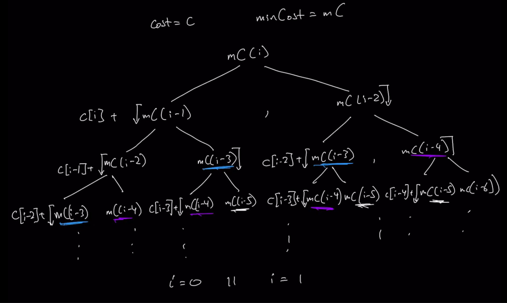

### Question 

* https://leetcode.com/problems/min-cost-climbing-stairs/
* Check main README on how to recognize it's a DP problem

### Step 7: Time and Space Complexity

* **For Author's brute force**
* Time Complexity: O(2^n)
  * Initial function call, 2 recursive calls
  * Definition of recursive function calls itself twice, Base 2
    * This is gonna call continously on both sides until n(or i) reaches 0
    * Doubling for every single value of n
* Space Complexity: O(2^n)
  * Call stack is constantly increasing and waiting(2^n values on the Call stack waiting to be resolved)

### Step 8: Optimize 

* Use Memoization to Optimize
* To do this, draw the State Space Tree
* 
* Top Down Memoize's 
  * Time Complexity: O(n)
    * As we are calculating for all n(or from i to 0) values one time and then using the stored values to retrieve for subsequent duplicate calls
  * Space Complexity: O(2n) ~O(n)
    * Recursive stack tree grows till size of n as only n calculations are done
    * dp also of size n
* Space can get even better with **Iterative Bottom Up approach**
* Bottom Up
  * Time Complexity: O(n)
  * Space Complexity: O(n)
* Bottom Up Optimized
  * Time Compexity: O(n)
  * Space Complexity: O(1)
    * No scaling data structures
    * 2 static variables