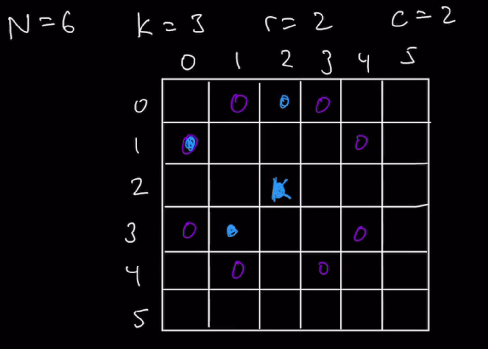

### Question

* https://leetcode.com/problems/knight-probability-in-chessboard/
```txt
On an n x n chessboard, a knight starts at the cell (row, column) and attempts to make exactly k moves. The rows and columns are 0-indexed, so the top-left cell is (0, 0), and the bottom-right cell is (n - 1, n - 1).

A chess knight has eight possible moves it can make, as illustrated below. Each move is two cells in a cardinal direction, then one cell in an orthogonal direction.

Each time the knight is to move, it chooses one of eight possible moves uniformly at random (even if the piece would go off the chessboard) and moves there.

The knight continues moving until it has made exactly k moves or has moved off the chessboard.

Return the probability that the knight remains on the board after it has stopped moving.
```

* **Break down the Question** when you get it like this
* We get the n value
  * We get to know the rows and columns from this
* row and column which are the starting values for the Knight
* k value
  * How many steps this Knight will end up moving
* 8 possible ways the Knight can move 


### Step 1: Verify the Constraints

* Will the Chessboard be big enough for atleast 1 valid Knight move
* Valid row and col values?
* Zero moves, what to return?
* **Author's**
* How many decimals do we round to?
  * Don't round, leave the answer as is

### Step 2: Write out some test cases


* Get test case from Interviewer
* Get k value to 3 when you are running
* Edge cases when n=0, k can be whatever for this: Return 0
* Also where n=2, k=3, r=1, c=1
  * The knight will move off the grid
* Case where k=0
  * Probability should be 1

### Step 3: Solution without code

* How to **realize it's a dp question**
  * Here there is nothing to do with minimum or maximum
  * Instead, think of what dp does for you
  * It *optimizes the process of generating all of the possible solutions that exist*
  * In this question, we are trying to get the overall probability of the knight staying on the Chessboard after making k moves
  * We have to generate the different possible paths the knight can take and combine all of them together to get the overall probability for this question
  * The fact that we need to generate all the possible paths tell you that DP can probably help you
  * Main thing we need to see here is whether or not there is an *overlap* in the possible paths we can take
  * Run through a simulation and force the knight to take an overlapping path along its way of taking different unique paths
  * 
  * There is Wasted steps that we could make and DP can help us out
* Get the Recurrence relation
  * To begin, we need to get a Generic formula that guides our logic of how our Recursive solution works
  * The Recursive solution would be Brute force(i.e no Memoization in the beginning)
  * To get Recursive solution
    * We need to think what is the main Problem we are trying to solve?
    * Can we break this down into smaller but Repeated sub-problems
    * The Subproblem should look like a reflection of the Main problem
* Define some type of function that represents our Recursive function
  * knightP(k,r,c) 
  * We are gonna receive Arguments and there is a relationship between the Arguments that we get and the Arguments that we pass to our subsequent Recursive function calls
  * n value is static and there is no relationship, i.e we don't vary the size of the Chessboard
  * The probability is determined based on where on the Chessboard the knight is placed, so row and column has a relationship(Impact on the probability)
    * The next possible row and column value we can take is dependent on current row and column values
  * k is definitely an argument because it has an impact whether the Knight stays or moves out of the Chessboard
    * When k is zero and the knight is in the Chessboard, then the Knight stays on the Chessboard(Prob of 1)
    * But when k is non-zero, the knight can be in the Chessboard or off the Chessboard after k moves
    * Next recursive call needs to subtract 1 from k
  * 

### Step 4: Solution with code

* Use Recursion and while calling the next direction divide by 8(Because it is one of the 8 directions)

### Step 5: Double Check for Errors

### Step 6: Walk through the Test case

### Step 7: Time and Space Complexity

* Brute Force
  * Time Complexity: O(8^k)
    * Loop over 8 different directions to perform 8 different recursive calls 
    * Over k levels expanding 8 directions every time
  * Space Complexity: O(8^k)
    * Stack for 8^k recursive calls

### Step 8: Optimize Solution

#### Top Down Recursive
* Massive State Space Tree if we want to draw it
  * So use our intuition and logical thinking and guide our thoughts by looking at the Recurrence relation formula
* How do we store to Memoize
  * Let's take for n=6, k=3, r=2, c=2
  * How many positions will our knight be in when k=3(Thinking from Top Down approach)
    * Only 1, because the knight starts at this position and hasn't taken any steps yet
    * When k=2, the knight could be in 8 possible places, since it starts from only 1 position
    * From k=1, we have to consider from previous k=2, there were 8 position
    * Need to think whether there are any overlaps from the steps which we took from the same k value
      * If it is then the remaining paths that we need to explore will be the same, so the same probability
* Use k value to determine the Grid that we store
* We need a 2Grid for every k value
  * k+1 Array because our Grid array is 0 indexed whereas our steps are not
  * Add +1 to get the actual corresponding index to match the step we are receiving
* Main thing to realize
  * Initialize an Array of 2d Arrays
  * The Array is going to hold the 2d array state at every given step of k
  * And we are building from the top down, i.e. when k is at maximum step
  * But in order to figure out the probability of all of the different positions the knight is in, which is only 1 position when k=3, we need to calculate the probability of the other steps at k=2
  * From k=2 different steps probability, we have to figure out what are the probabilities of those steps by combining them with all of the probability of k=1 of all the different steps we could have reached when k=2
  * Once we go Top down and figure out all of the different probabilities, we come back up and add all those values together and we just make sure not to duplicate any of our steps that were extra to take, by storing them inside of the dp
  * **Crux of the calculation is dependent on k**
    * k is what dictates that there are overlapping steps
* Time Complexity: O(n^2*k)
  * Iterating over k different steps
  * At every step, how many different recursive calls can we make
  * How many values can we fill for that given step?
  * In worst case where we have a lot of steps, you can imagine that we propogate a bunch of steps down and we end up filling every single value in the 2d Grid, because every value might be able to be reached every single Grid cell
  * n^2 different values we can fill for that Grid
  * At the same time, every single step down is represented by a brand new Grid
  * At a certain point, we overlap over every single cell in the Grid and for every level that might happen
* Space Complexity: O(n^2*k)
  * Size of dp

#### Bottom Up Iterative

* We are trying to build towards the final solution
* What we are building is dependent on what we are storing
* In order to evaluate what we are storing, it is based of the recurrence relation as well as the recursive solution
* What we are storing in our dp in Recursive solution?
  * We have a array that contains numerous different 2D Grids
  * These 2D grids represent the values that you can reach from the previous step at k
* k is the main thing that drives our Recursion
* What you do with this k value is you subtract it and pass it down
* The size of the Recursion is equal to k(maximum depth)
* What we need to figure out is utilize this k value differently and build from the bottom up instead
* In Top Down, we are starting k=3 and going all the way to k=0
* Is there a way where we can go from k=0 to k=3(IN our example case)
* Think about How do I build layer by layer so that I get all of the steps that I need for one level of k before I move up to the next level
* Because once I have all of the values that I need for k=0, then it's easy to build for k=1
* Once I have values for k=1 and k=0, can I use them, whether I require one layer or both layers to build k=2
* The idea is you are constantly trying to figure out if you can encode the entire level before moving on to the next level
* **Add more notes later in video 169**
  
##### **Keywords for now**
* Store?
  * What
  * Based off
* Build layer by layer
* Hints from Recursive solution
* Leverage what you have stored in previous level for Bottom Up
* Very first grid is k=0
* When knight is placed on the board for the first time, we are not taking any steps, so this is the starting point, i.e k=0. The probability of that initial row, column is 1 and rest all are 0
* Then build from the previous Grids as shown below
  * Reachability from Previous Grid cell
* 

##### Iterative

```txt
* Time Complexity: O(8*k*2n^2) ~ O(k*n^2)
* Space Complexity: O(n^2*k)
```
* Further optimize by maintaining only 2 Grids, i.e. previous and current
```txt
* Time Complexity: O(8*k*2n^2) ~ O(k*n^2)
* Space Complexity: O(n^2*2) ~ O(n^2)
```