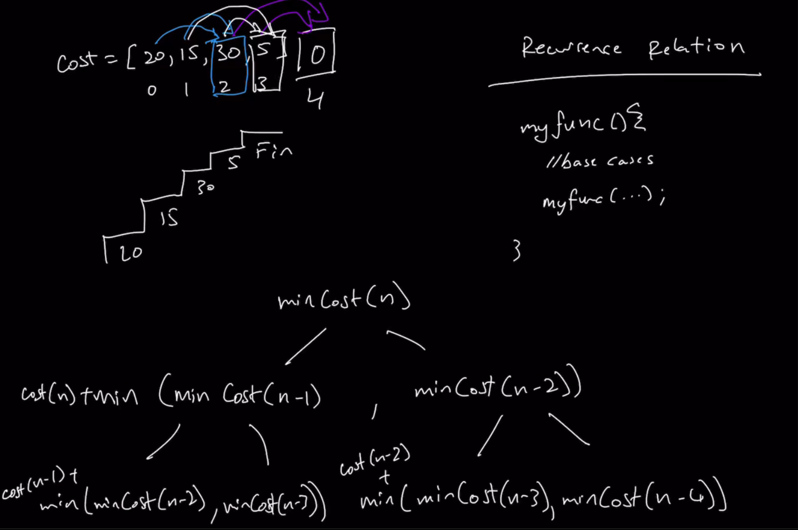

### Dynamic Programming

* Check **Graph's README** for Greedy and Dynamic Topics

### How to Recognize it's a Dynamic Programming Problem

* Most of the times, Optimization questions(MinMax) are DP problems and also Questions that require Memoization(Storage for future reference)
  * Among all possible solutions, you picking the best one
* Not all problems that have DP as a potential solution require DP as a solution
* With Optimization questions,
  * we need to generate all of the possible paths that we can take
  * Pick the one with the minimum value(w.r.t 26th question)
* DP has many stages and at every stage you are writing a viable solution
* Every subsequent stage becomes more optimized in terms of Space and Time Complexity

### Dynamic Programming Solution

* Dynamic Programming has its basis in **Recursion**(Starting point for 1st solution)
* Template for Recursion
  * basecases
  * Recursive function call with arguments
* The template is based on **Recurrence Relation**
  * Recurrence Relation is the Formula for the basis of a recursive solution
1. Figure out Recurrence Relation
2. Get the Formula
3. Use the formula to derive a initial Recursive solution
4. From the Recursive solution, draw a State Space Tree and figure out where you are wasting cycles
5. Utilize some type of Memoization(data structure similiar to the data structure you are iterating through)

### Getting the Recurrence Relation

* Think of the **final condition** or the **Big problem**(minCost from start to top of the floor) we are trying to solve(For this question, top of the floor)(Top Down Approach)
  * From recurrence standpoint, top floor(Step n) is the place that I want to get to
  * Is there a way that i can redefine this problem as a **repeated problem** that we can combine together to get the final answer
  * 
  * To reach top of the floor, 2 possibilities(2 possible paths)
    * Using n-1 or n-2
    * More precisely, minimum of cost(n)+ (minCost(n-1), minCost(n-2)), let cost(n) = 0, where n is top of the floor, minCost is in turn the minimum cost to reach the given floor
    * Similarly, minCost(n-1) and minCost(n-2) is calculated by cost(n-1) + min(minCost(n-2), minCost(n-3)) and cost(n-2) + min(minCost(n-3), minCost(n-4)) respectively
    * This is carried till n=0(i.e., till there is no step)
    * i < 0 = 0
    * i === 0 = cost[0]
    * i === 1 = cost[1]
* You see a pattern from the diagram, i.e the relationship between the function call given its arguments and its internal subsequent function call and the arguments that they receive
  * minCost(i) = cost[i] + min(minCost(i-1), minCost(i-2))
  * Derive basecases from the above formula
  * It works for all values of i except a couple of instances(0 and 1), if the entire array is just empty, we'll call on -1 and -2 which are non-existing
    * i < 0 return 0
    * i === 0 return cost[0]
    * i === 1 return cost[1](Minimum cost to reach 1 is directly 1 and not by climbing step 0(cause this is non-negative))
  * From this formula, we can now build the Actual recursion function
* **When building out the tree**(shown in diagram), we don't really care about the **low-level implementation**
  * All you care is the actual logic that matters(i.e lowest cost to reach that step)

### Bottom Up approach

* Convert Recursive to Iterative solution
  * Remove the need for Call Stack
  * Recursively calling down until we reach our Base cases, where we do know the Answer
* With Top Down approach
  * I don't know what the answer to reach these points are, so I am gonna build those
  * We go down first and then we have to resolve till top
* With Bottom Up approach, ignore the recursive call all the way down and iteratively build from the Base cases
* From Recurrence relation formula, if we plug in value of i=2, we have calculations for 2