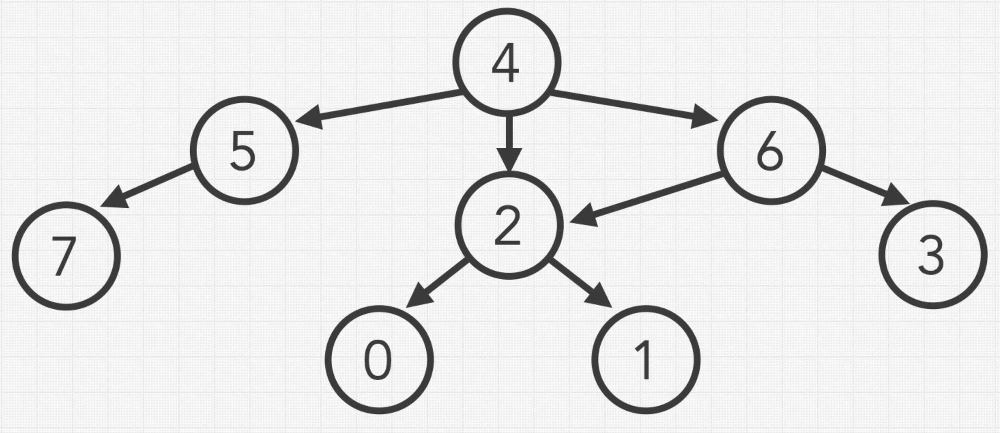
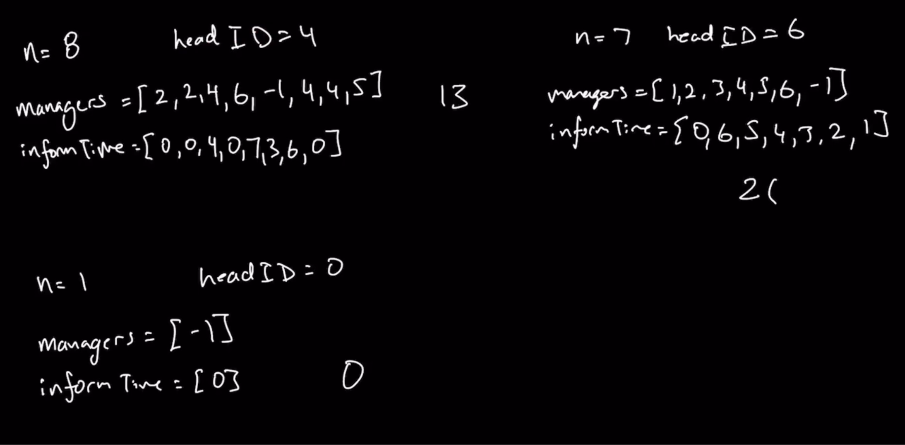
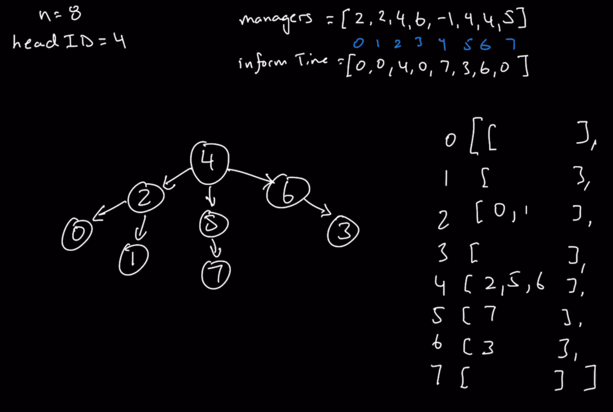

### Question

* https://leetcode.com/problems/time-needed-to-inform-all-employees/
```txt
A company has n employees with a unique ID for each employee from 0 to n - 1. The head of the company is the one with headID.

Each employee has one direct manager given in the manager array where manager[i] is the direct manager of the i-th employee, manager[headID] = -1. Also, it is guaranteed that the subordination relationships have a tree structure.

The head of the company wants to inform all the company employees of an urgent piece of news. He will inform his direct subordinates, and they will inform their subordinates, and so on until all employees know about the urgent news.

The i-th employee needs informTime[i] minutes to inform all of his direct subordinates (i.e., After informTime[i] minutes, all his direct subordinates can start spreading the news).

Return the number of minutes needed to inform all the employees about the urgent news.
```

### Step 1: Verify the Constrainsts

* Cyclic?
  * Nope, because it is mentioned in the question, that the subordination is a tree structure
  * Trees are directed in one direction
* It may not be cyclic, but is circular possible as shown in the below diagram

* Can employees have more than 1 manager?
  * No
* Unconnected?
  * Does every employee have a manager? Yes, except the head
* Weighted?
* Directed?
  * Yes, since it is a tree

### Step 2: Some test cases


* n = 1, headID = 0, manager = [-1], informTime = [0]
  * 0
* Tree where all children are only left or right
* Ask Interviewer to get the test cases for this

### Step 3: Solution without code

* I created a dictionary of lists where key is the manager and values are the list of employees under him/her
* Later, I used a timeFromHead array to calculate all values from head to all the employees
* Used a list to hold all employees directly under head and then iterated all the subordinates under them and updating the timeFromHead
* **Author's approach**
* The question might be abstract and you wouldn't know it's a Graph question
* The question hints it's a n-ary tree
* If it is a n-ary tree, **then it's most likely a Graph question**
* Next, we need to figure out which is better, adjacency lists or adjacency matrix
  * For this, **draw out how the graph looks like**
  * 
  * Directed or Undirected? Directed, because we don't back to the manager
  * Check out the connections between a vertex to every other vertices
  * Only when there are more connections, use Adjacency matrix(for every pair of node), else use Adjacency list
  * Here, in this question, there are no connections between nodes on the same level and to other nodes children
  * So use adjacency list
* Next, what traversal? BFS or DFS
  * We can use anything, as they both have O(n) space and time complexity


### Step 4: Solution with code

### Step 5: Double check for Errors

### Step 6: Walk through the Test Cases

### Step 7: Time and Space Complexity