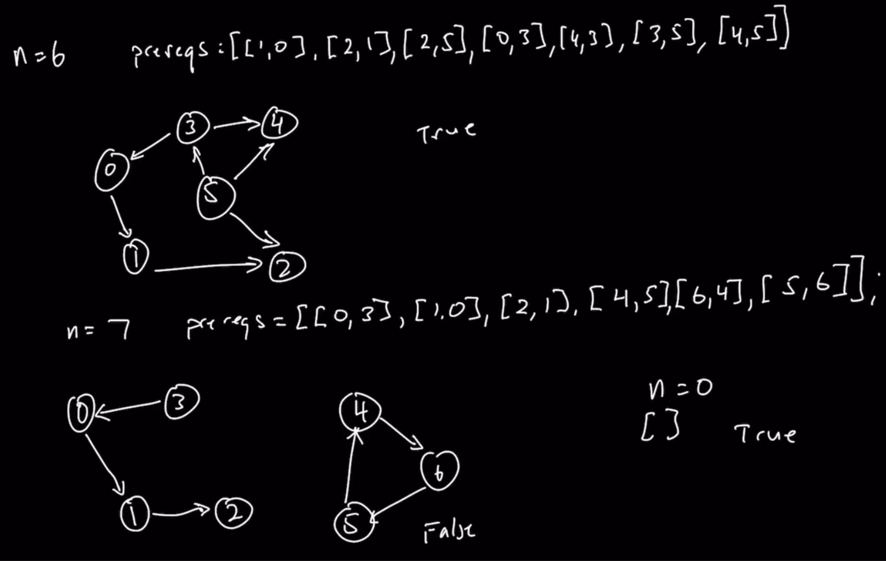

### Question

* https://leetcode.com/problems/course-schedule/
```txt
There are a total of numCourses courses you have to take, labeled from 0 to numCourses - 1. You are given an array prerequisites where prerequisites[i] = [ai, bi] indicates that you must take course bi first if you want to take course ai.

For example, the pair [0, 1], indicates that to take course 0 you have to first take course 1.
Return true if you can finish all courses. Otherwise, return false.
```

### Step 1: Verify the Constraints

* Can the courses be unconnected
  * Yes, account for separate course chains
* Empty numCourses, what to return
  * True

### Step 2: Some Test Cases


* First, connected with cycle and without cycle
* Next, unconnected where there is no cycle in all of the disconnected graphs
* Next, unconnected where there is cycle in one and not in rest
* Next, unconnected where there is cycle in all

### Step 3: Solution without Code

* Traverse each node sequentially 
* **Author's approach**
* This question doesn't suggest it's a Graph question
* We have to look out if there is a Graph structure here
* Prerequisite courses can be expressed as vertices and directed edge
* We cannot finish a course, if there is a cycle
* **Get help from interviewer for the test cases because there are a lot of variations**, like can we work on some test cases together so that I will get a good idea on what I need to cover
* Graph to input and input to graph, to come with test cases

### Step 4: Solution with code

### Step 5: Double check for Errors

### Step 6: Walk through the Test Case

### Step 7: Time and Space Complexity