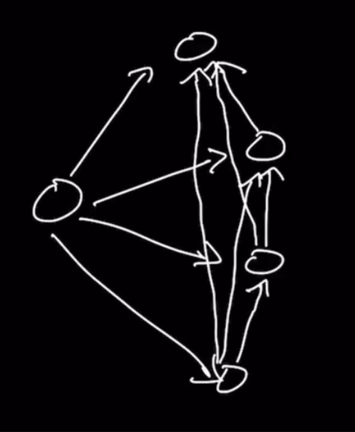

### Question

* https://leetcode.com/problems/course-schedule/
```txt
There are a total of numCourses courses you have to take, labeled from 0 to numCourses - 1. You are given an array prerequisites where prerequisites[i] = [ai, bi] indicates that you must take course bi first if you want to take course ai.

For example, the pair [0, 1], indicates that to take course 0 you have to first take course 1.
Return true if you can finish all courses. Otherwise, return false.
```

### Step 1: Verify the Constraints

* Can the courses be unconnected
  * Yes, account for separate course chains
* Empty numCourses, what to return
  * True

### Step 2: Some Test Cases


* First, connected with cycle and without cycle
* Next, unconnected where there is no cycle in all of the disconnected graphs
* Next, unconnected where there is cycle in one and not in rest
* Next, unconnected where there is cycle in all

### Step 3: Solution without Code

* Traverse each node sequentially 
* **Author's approach**
* This question doesn't suggest it's a Graph question
* We have to look out if there is a Graph structure here
* Prerequisite courses can be expressed as vertices and directed edge
* We cannot finish a course, if there is a cycle
* **Get help from interviewer for the test cases because there are a lot of variations**, like can we work on some test cases together so that I will get a good idea on what I need to cover
* Graph to input and input to graph, to come up with test cases
* **Brute force approach with either bfs or dfs**
* When Looking for cycle, start from some node and perform a traversal
* While performing traversal, if we ever make it back to the node we have seen, then cycle exists
* The graph could be unconnected, so we have to perform traversal on every single node
* **Topological sort**
* This can applied to only DAG(Directed Acyclic Graphs)
* It is based on In-degree(Connections coming into a node)
* Initially, In-degree is calculated for each node
* Any node with In-degree 0 is pushed to the result and other nodes' In-degree count is reduced to whichever this node was pointing to
* 

### Step 4: Solution with code

```js
const adjList = new Array(numCourses).fill(0).map(() => []);
```
* Here in above code, we can't directly fill [] to numCourses, cause the same empty list object is referred
* Also we can't directly map after creating newArray(numCourse) cause there is nothing to map over

### Step 5: Double check for Errors

### Step 6: Walk through the Test Case

### Step 7: Time and Space Complexity
* For Author's Brute force
  * Time Complexity: O(p + n^3)
    * O(n) for empty adjList creation
    * O(p) for filling of adjList, p being the the length of prerequisite pairs
    * for loop that touches every element, O(n)
      * 
      * Inside this we push to the queue, this in worst case be O(n)
      * while loop of queue length is O(n), cause all the values can be shoved into the queue
        * for loop in adjacent can loop through all the other nodes, so it's O(n)
  * Space Complexity: O(n^2)
    * New adjList, O(n^2)
      * Nested, every node points to every other node
    * Queue, O(n)
    * Seen, O(n)