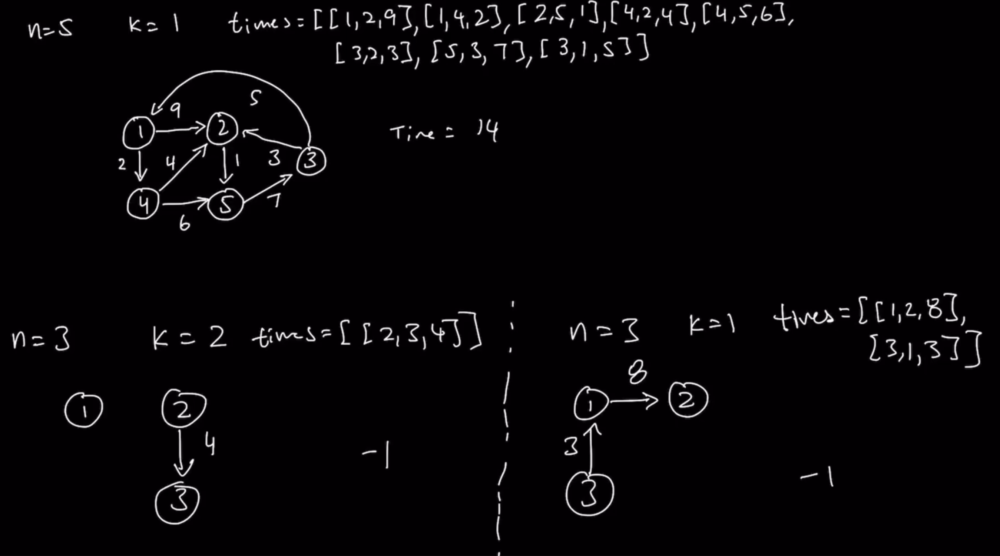

### Question

* https://leetcode.com/problems/network-delay-time/
```txt
You are given a network of n nodes, labeled from 1 to n. You are also given times, a list of travel times as directed edges times[i] = (ui, vi, wi), where ui is the source node, vi is the target node, and wi is the time it takes for a signal to travel from source to target.

We will send a signal from a given node k. Return the time it takes for all the n nodes to receive the signal. If it is impossible for all the n nodes to receive the signal, return -1.
```

### Step 1: Verify the Constraints

* Can the graph be unconnected
  * Yes and return -1
* Empty graph
* Can time(weight) be negative integers
  * No
  * If yes, then ask for Negative cycles

### Step 2: Write out some test cases

* [[1,2,10], [1,3,2], [1,4,3], [3,2,4], [4,5,7], [5,2,6], [5,1,4]]
* **Author's**


### Step 3: Solution without code

* **Author's approach**
* This question is an **Optimization question(minimum value or maximum value)**
* If the question asks for Shortest path for a given source node in a Weighted directed Graph, then we already have 2 algorithms for it
* DFS and BFS are very verbose and time-consuming
* Check Dijkstra's algorithm in Graphs README
* I used lists instead of Priority Queue
* Check author folder for Priority Queue Implementation

### Step 4: Solution with Code

* Python has a library for Min Heap(heapq), so use that

### Step 5: Double Check for Errors

### Step 6: Walk through the Test Cases

### Step 7: Time and Space Complexity

* Does not matter whether there are Cycles in the Graph
* Worst possible Graph we could receive is a Complete Graph(Every vertex connects to every other vertex)
* **Author's Dijkstra's**
* Time Complexity: O(n+ElogE)
  * O(2n) for distances array and also adjList, n is the number of vertices
  * O(E) for iterating times array, where E is the number of edges
  * In the Heap(while loop), we can pull out E potential values and push and pop is O(logE), so it's ElogE
    * What is the Heap containing? Edges
  * So it's O(2n+E+ElogE): O(n+ElogE)
    * E in worst case can be n^2
* Space Complexity: O(n+2E): O(n+E)
  * Distances: O(n)
  * adjList: O(E)
    * Not required just like Bellman
  * Heap: O(E)

* **Author's Bellman-Ford's**
* Time Complexity: O(n+nE) ~ O(nE)
  * distances: O(n)
  * Outer for loop: O(n)
    * Inner for times loop: O(E), where E is the number of edges
  * Space Complexity: O(n)
    * Distances array
* *Dijkstra's is faster*