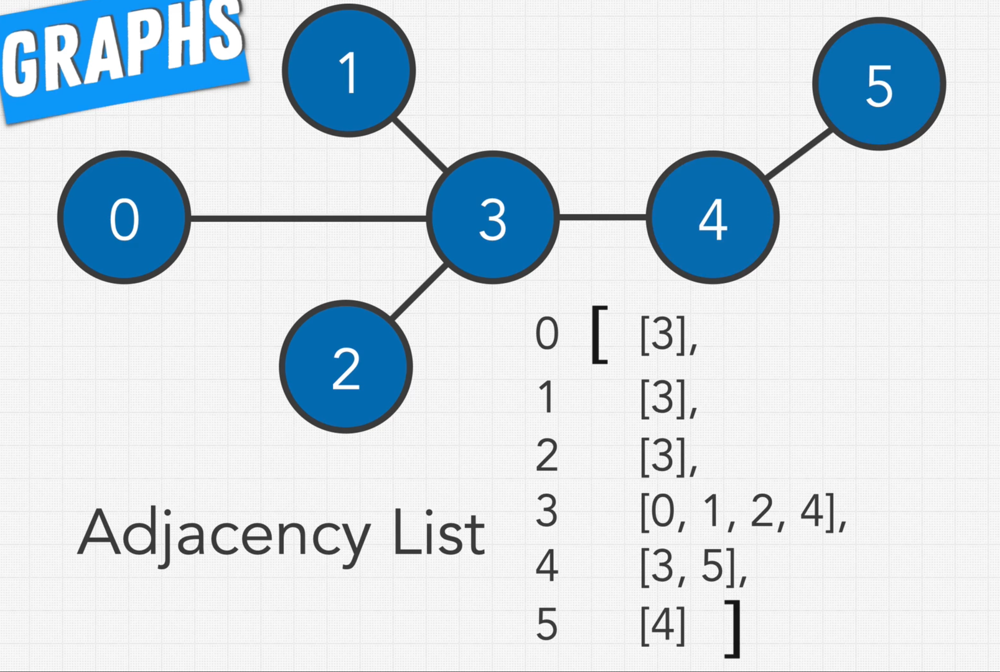
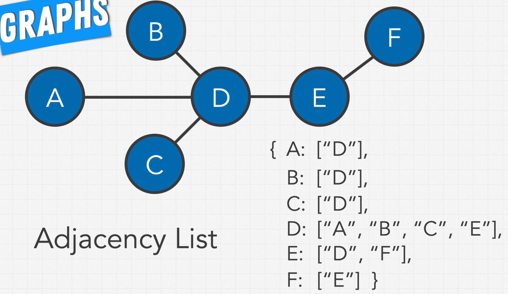
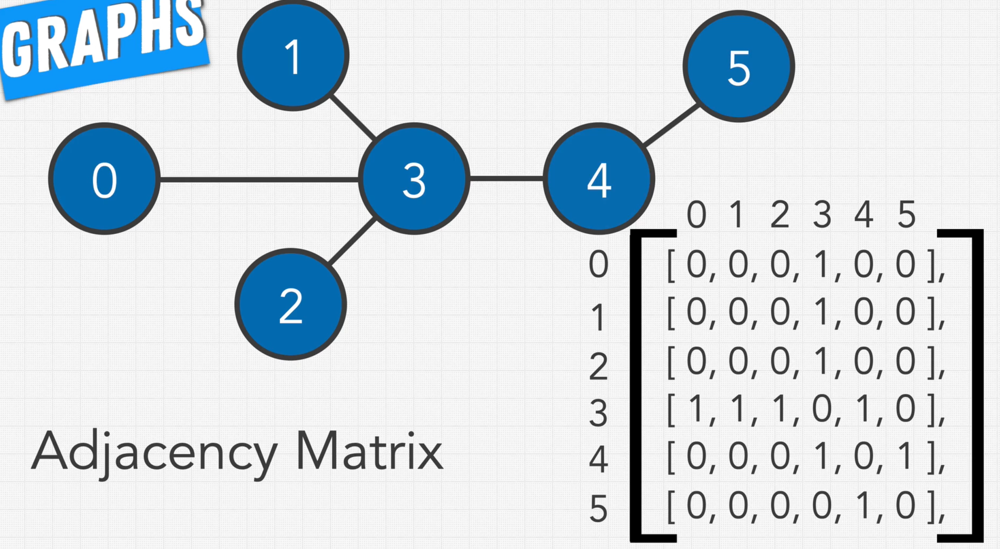
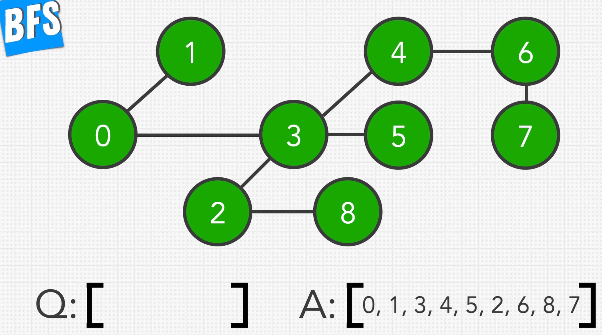
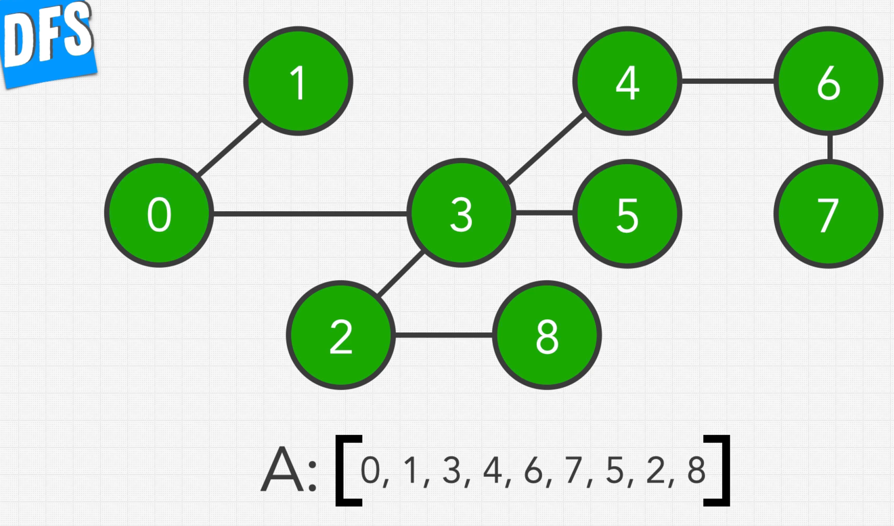
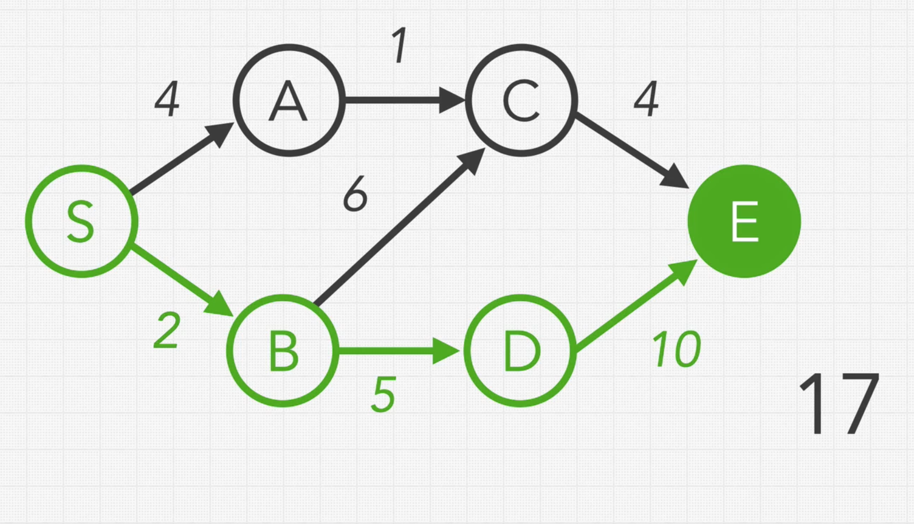
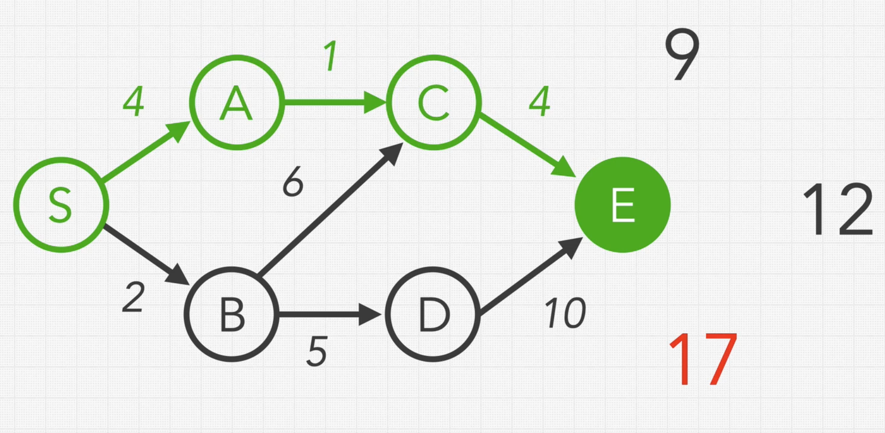
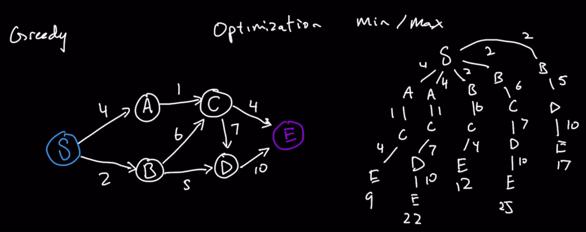
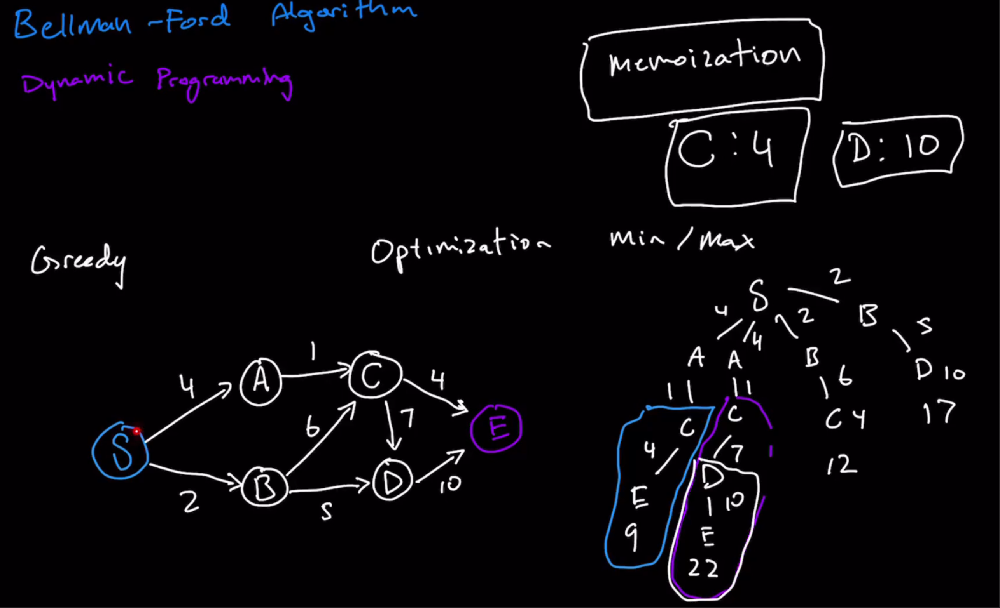

### Graphs

* Collection of nodes(vertex) and connections(edges)
* Nodes can have any number of connections
* Possibilities of Cycle(Circular connection)
* Undirected and Directed
* Unweighted(No weight to edges) and Weighted
* Unconnected Graph(Entirety of all nodes not connected as one Structure)
* All Trees are Graphs, but not all Graphs are Trees
* Binary Tree as a Directed Graph
* 2D arrays also represent Graph

### Representation of Graphs

* Adjacency List and Adjacency Matrix

### Adjacency List

* List or Object 
* List where Index value corresponds to nodes
* Nodes attached as value to the index

### Adjacency Matrix

### BFS

### DFS

### Dijkstra's Algorithm

* **Greedy method Algorithm**
  * It's an algorithm paradigm(way that we tackle problems)
  * Only applies when working with Optimization problems(Max or Min value)
  * If decision needs to be made between all the options, it picks the one that gets to the optimum solution
  * Limitations of Greedy:
  * 
  * It chooses 2(between 2 and 4), 5(between 5 and 6) and 10: 17
  * But there are better paths
  * 
  * Doesn't care about the future steps, just thinks about what is the greediest path right now
* Dijkstra's takes the concept of Greedy and utilizes in a way that covers the above weakness
* Dijkstra's Algorithm can only be applied to Graphs that are Directed and Weighted(Non-negative)
  * Allows to find the Shortest possible path we can take to reach each of the different nodes
* Initial array containing Infinity to all the nodes
  * Put zero to the starting node's value
  * If we can directly travel from start node, then we update that value, else leave as it is
  * Close off the starting node, we are never going back to it
* Next choose the smallest value in the Array and repeat the above process and updating only if it shorter than the previous

### Cons of Dijkstra's Algorithm

* Cannot handle negative weights
  * We close off a node and never visit it back
* So, we use Bellman-Ford's Algorithm
* https://stackoverflow.com/questions/6799172/negative-weights-using-dijkstras-algorithm/6799344#6799344
* But Author's implementation solves the above
* The logic of our *if condition* that checks the weight of that node against the current path that determines if we relax that node further we can guarantee will never actually pass after that nodes already been processed before due to the greedy method logic!
* This however changes if we have *negative weights*, as I explain in the video the code may still run and you can definitely have a case where the same node is not only pushed in the heap *multiple times*, but fully processed as well because it could pass that conditional if statement since there’s no guarantee anymore that our greedy method logic is still relevant. The node could indeed have a lower weight from a new path coming into it due to the presence of negative weights. I**f there aren’t any negative cycles in the graph**, our dijkstras code can in fact *still solve the question*, but you are no longer guaranteed the time complexity from before (which is achieved with the aforementioned greedy method guaranteeing that we don’t FULLY process the same node more than once). For this reason we switch over to using bellman Ford

### Bellman-Ford's Algorithm

* **Dynamic Programming**
  * 100% accuracy is calculate every single value and then pick the value that is the smallest(or largest)
  * All possibilities, but store repetative work
  * Memoization: Store values so that we could reuse it later
    * Store for repeated calculations like in the diagram below for CE, CDE and DE
    * What to store and why?
    * *Why* can usually be reframed from the Optimization question on the whole Graph down to a smaller scale
      * In the Context of this graph question, we are trying to find out a Minimization Optimization question
      * The Minimization is the lowest costing path from the Source to the Destination
      * If we have to reframe that on a smaller scale and figure out if there is a repeated step there at every single node, the question then becomes what is the shortest path of all of my options from each node to the end node
      * Once we figure out all of the paths for C, then we want to store the shortest path from C to E(This is a smaller version of the Bigger problem)
* State Space Tree: All possible paths from Source to Destination
  * What state every vertex is in and what decision we make amongst all the possible choices
* 
* 
* **Bellman-Ford Algorithm**
* Given, Source vertex the lowest cost path to every other vertex
* Reduce to question to understand the Memoization aspect
* From a particular source vertex, what is the lowest costing path to any random vertex(Pick worst case scenario)
  * In the worst case scenario, what is the most number of edges that we will traverse through in order to get to a vertex(Furtest vertex)
  * We don't wanna run in cycles, cause that's just wasting steps
  * If we consider the below diagram, it's 1 to 4, 4 to 2, 2 to 5 and 5 to 3(Notice that we are walking through every single vertex(n-1))
* Analyze the question even further
  * If we are trying out to figure the shortest possible path to some specific target vertex, we do need to explore all of the paths available
  * There are n-1 edges to pass through in the worst possible path, but there might be numerous n-1 paths and much significantly shorter paths also
  * We want to calculate for all of them
  * In order to optimize the Computation, save some of these results through Memoization
* What we want to Memoize is going to be driven by reducing this Question down a little further
* We can infer through all of our traversals that we are probably gonna walk through the same vertex numerous times
* What we want to keep track of is the lowest cost up to that point for that given vertex
* We are trying to set up each vertex as another Starting point with the Shortest path experienced so far starting from 1 as the Source node
* How we are going to do that is to iterate through all of the possible edges that we have
* We are gonna keep track of lowest cost up to the vertex so far and perform this check n-1 times(worst possible case)
  * Keep starting vertex's value as 0 and rest all are Infinity

### Cons of Bellman-Ford

* Doesn't work for Negative cycle
  * The values in one of the vertices will constantly go down, i.e. after n-1 iterations the value will keep reducing at one of these nodes inside the negative cycle for any subsequent iteration
* But we can check for Negative cycle through this Algorithm
* If one of the distance values changes after n-1 iterations, then there is a Negative cycle