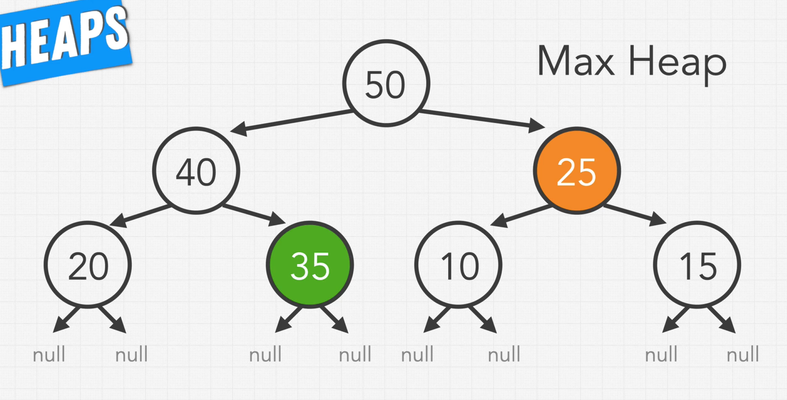
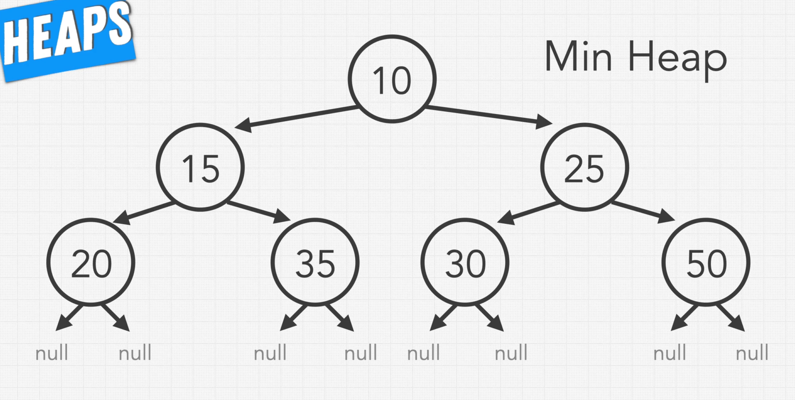

### Heaps

* Resembles Complete Binary Tree 
  * Complete Binary Tree: Every level, except possibly the last, is completely filled in a complete binary tree, and all nodes in the last level are as far left as possible
* 2 variations in Heap
  * Max Heap: The root is the greatest value and every single node has greater value than its children
  * Min Heap: The root is the smallest value and every single node has lesser value than its children

* Represented using Array and using BFS the values are filled
  * 1st value is the root of the Tree
* Formulas
  * Parent: floor((idx-1)/2)
  * Left child: (idx*2) + 1
  * Right child: (idx*2) + 2
* While inserting a new element, it is inserted at the very end(According to BFS, left to right)
  * Then comparisons are made to its parents until it is in its valid spot
* Purpose of removal is to get the Greatest value or the Smallest value from the Heap
  * After removing the root, the last value from the array(From the Complete Binary tree) is removed and made the root
  * Then it is compared with its children until it is in its valid spot

### Priority Queue

* It is a queue data structure with priorities as values
* It's Max Heap when priority is the greatest value and Min Heap when priority is the smallest value

### Time and Space Complexity

* Size Complexity is O(n)
* Time Complexity
  * Insertion: O(logn)
    * Inserting at the very end and then sorting out which will be the height of the tree
  * Deletion: O(logn)
    * Deletion at the top and then sorting out which will be the height of the tree   