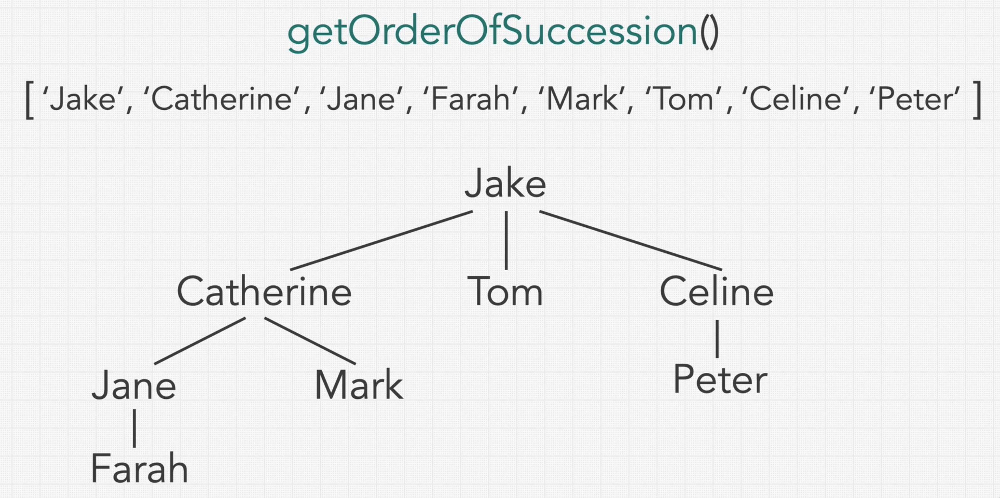
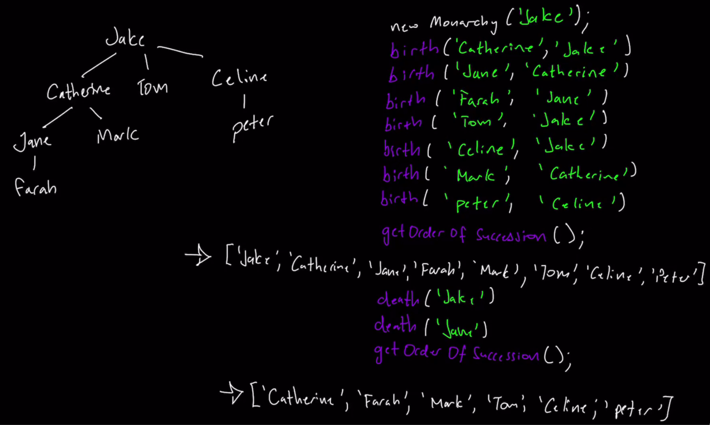

### Question 

* Given the following interface, implement its methods
```txt
interface Monarchy {
  void birth(String child, String parent);
  void death(String name);
  List<String> getOrderOfSuccession();
}
```
* Build a Monarchy Family Tree
```txt
new Monarchy('Jake');
birth('Catherine', 'Jake');
...
birth('Peter', 'Celine');
```


### Step 1: Verify the Constraints

* Can we implement helper classes/objects(Own additional classes unrelated to monarchy)?
  * Yes, you can use any features you see fit

### Step 2: Write out some test cases


* Here it doesn't matter when Tom gets born as long as it's after Catherine
* Similarly for Celine
* Think of the Constrainsts(like killing of one of them )

### Step 3: Solution without Code

* Think really deeply about the test case as well as the different methods and their functionality
* Is there any data structure that can help us?
* Structure: Family tree
* In this case, it is a n-ary tree
* Order of Succession achieved using Pre-order Depth First Search
* But death affects the Order of Succession
  * Also, we shouldn't take out the dead Person from the tree cause we lose the link to his/her Children
  * So use isAlive
* We need quick access to any Person(Tree node), so we use HashMap

### Step 7: Time and Space Complexity

* Time Complexity
  * Birth: O(1)
  * Death: O(1) because of Hashmap
  * getOrderOfSuccession: O(nlogn)
    * dfs: O(nlogn)? is this correct
    * n is the total number of people in the tree