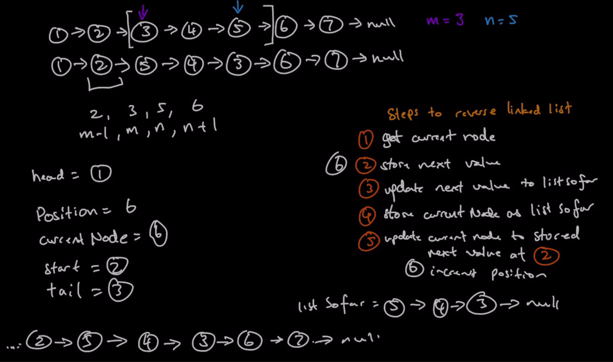

### Question

* Given the head of a singly linked list and two integers left and right where left <= right, reverse the nodes of the list from position left to position right, and return the reversed list.
* https://leetcode.com/problems/reverse-linked-list-ii/

### Step 1: Verify the Constraints

* Empty linked lists, what do we return
* Will m and n always apply(i.e will m and n always be within the bounds of the linked list)
  * Yes, assume 1 <= m <=n <= length of linked list
* Positioning is 0 index or 1 index for m and n
* Will there be cycle 
* Are the values integers or characters
* Can we receive m and n values for the whole linked list(I didn't think of this)
  * Yes

### Step 2: Example Test Cases

* 1,2,3,4,5 m=2, n=4
  * 1,4,3,2,5
* 1,2,3,4,5 m=1, n=5
  * 5,4,3,2,1
* 5 m=1, n=1
  * 5
* [] m = 0, n = 0
  * null

### Step 3: Soln without code

* Get the handle before left
* I thought of moving the elements from left to right 
* **Author's solution**
* **Reversing a linked list** is a **subproblem** here
* Steps to reverse a linked list
  * Get current node
  * Store next value
  * Update next value of current to listSoFar
  * Store current node as listSoFar
  * Update current node to stored next value at 2
* Key insights
  * Look at each node(which are important) and to do this we need to Look at the whole linked list
  * The important points are m-1, m, n and n+1
    * m-1 needs to point to new head
    * mth should point to n+1
    * m to n: Subproblem of reversing a linked list
    * n will be the new head
    * The tail of the subproblem should point to n+1
  * To keep track, we need head, start, tail, currentNode and position

### Step 4: Soln with code

* Just like reversing the whole linked list, except here we are moving the elements from left to right(only the links)
* **Author's implementation**
* Involves 4 key elements: start(m-1), tail(m), n(head), n+1(tail link to this)

### Step 5: Double check for errors

* Mistake on my part is while returning the head
  * I should have questioned myself more there
### Step 6: Walk through the test cases

### Step 7: Time and Space Complexity

* Time Complexity: O(n)
* Space Complexity: O(1)

### Step 8: Can we Optimize?