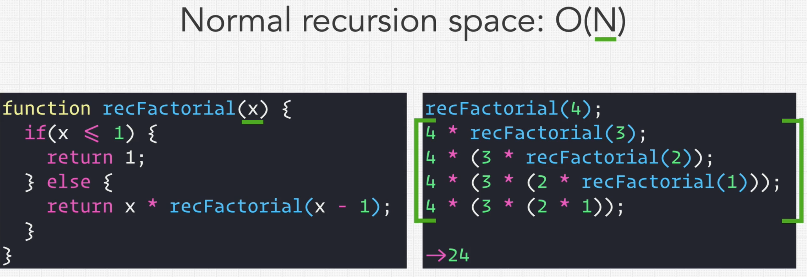

### Recursion

* Base case
* Recursive case
* What to return

### Normal and Tail Recursion

* Normal Recursion's Space Complexity: O(n)
* Tail Recursion's Space Complexity: O(1)

  * 4 calls
  * Here multiplication needs to wait

  * Multiplication doesn't need to wait
  * Nothing is waiting here
  * So since there is no dependency, the earlier calls can be popped off the stack
  * But the language's compiler should also support this

### Divide and Conquer

* Applying this to quicksort
1. Multi-branched recursion
  * Left of partition
  * Right of partition
2. Breaks a problem into multiple smaller but same sub-problems
  * Same technique of finding partition and calling quicksort left of partition and right of partition
3. Combines the solutions of sub-problems into the solution for the original problem
  * Combine all the solutions to get the sorted array
